## Hey, I'm Cam 👋

🔭 Statistics, Data, and Digital, based in the North East (UK)

⚡ R and Python developer interested in all things data and development

💬 Ask me about tidy data, data visualisation, web accessibility, and R Shiny / R packages

🔎 Have a look at [dfe-analytical-services](https://github.com/dfe-analytical-services)

 

 

GitHub statistics provided using [GitHub Readme Stats](https://github.com/anuraghazra/github-readme-stats). **languages only covers my public repositories, excludes forks, contributions in other organisations, and presentation repositories*
